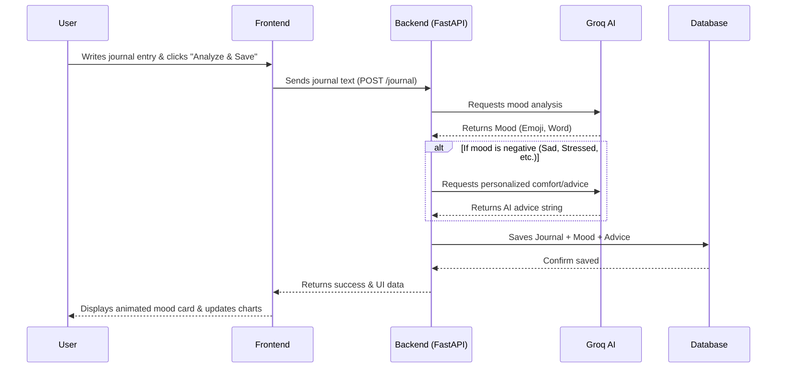

<div align="center">
  <h1>AI-Powered Journal 📝✨</h1>
  
  
  
  
  
  
  
  

  <p>A modern, dynamic journaling application that uses AI to analyze your mood, provide empathetic comfort, and track your emotional wellbeing over time.</p>
</div>

## ⚙️ How It Works (Workflow)



## ✨ Features

- **🧠 AI Mood Analysis**: Write a journal entry and get an instant AI evaluation of your mood (including an emoji, a title, a short description, and related emotional tags).
- **💝 AI Comfort & Advice**: If the AI detects a negative mood (sadness, stress, anxiety, etc.), it generates a personalized, empathetic message with actionable advice based on what you wrote.
- **🔥 Journaling Streak & Goals**: Track your daily journaling streaks and hit a daily word count goal (progress bar turns green when you hit 30 words).
- **📊 Analytics & Visualizations**:
  - **Weekly Summary**: See how many entries you've written, your most common mood, and your most active day.
  - **Mood Trends Chart**: A visual breakdown of your most frequent emotions.
  - **Mood Calendar**: A beautiful monthly grid coloring the days based on your predominant mood.
- **🔍 Organization**:
  - **Search & Filter**: Find past entries instantly by text or filter them by specific moods.
  - **Inline Editing & Pinning**: Pin important entries to the top, edit existing entries inline, and delete entries.
- **📤 Export**: Download all your journal entries and AI advice as a `.txt` file for safekeeping.
- **🌙 Dark Mode**: A sleek, system-aware dark mode toggle.

## 🛠️ Technology Stack

- **Backend (Python, FastAPI)**: We used FastAPI because of its incredible performance, built-in asynchronous support, and automatic data validation. It makes building REST APIs fast and resilient.
- **Database (SQLite & SQLAlchemy)**: We chose SQLite for local development because it requires zero configuration or external servers, making the app extremely portable and lightweight.
- **AI Engine (Groq API - Llama-3)**: Groq's inference engine was chosen for its blazing fast speed, ensuring the AI mood analysis feels instantaneous and doesn't interrupt the user's journaling flow.
- **Frontend (HTML5, CSS3, Vanilla JS)**: Built without heavy frameworks like React or Vue to keep the codebase simple, fast to load, and easy to run directly from the browser without a complex build step.

## 🚀 Getting Started

### Prerequisites
- Python 3.9+
- Groq API Key

### Installation

1. **Clone the repository** (if applicable) and navigate to the project directory:
   ```bash
   cd AI_Journal
   ```

2. **Install Backend Dependencies**:
   ```bash
   cd backend
   pip install fastapi uvicorn sqlalchemy python-dotenv groq
   ```

3. **Set up Environment Variables**:
   Create a `.env` file inside the `backend` directory and add your Groq API key:
   ```env
   Groq_API_KEY=your_api_key_here
   ```


. **Open the Frontend**:
   Simply open `frontend/index.html` in your favorite web browser!

## 📂 Project Structure

```
AI_Journal/
├── backend/
│   ├── main.py                 # FastAPI application and CORS setup
│   ├── journal.py              # API routing and endpoints
│   ├── database/
│   │   └── db.py               # SQLite database setup and session
│   ├── models/
│   │   └── journal_model.py    # SQLAlchemy database models
│   ├── schemas/
│   │   └── journal_schema.py   # Pydantic schemas for data validation
│   └── services/
│       ├── ai_service.py       # Groq integration for mood analysis
│       ├── comfort_service.py  # Groq integration for AI empathy/advice
│       └── suggestion_service.py # Fallback suggestions based on mood
└── frontend/
    ├── index.html              # Main UI structure and styling
    └── script.js               # Frontend logic and API integration
```

## 🤝 Contributing
Feel free to fork this project, submit pull requests, or open issues to suggest new features or report bugs!
